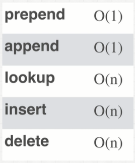
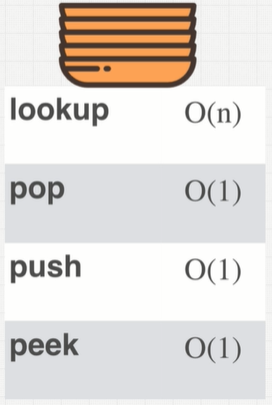
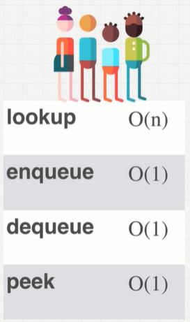

# bigO

Comparing element vs number of operations

Above example is O(n) - aka Linear Time

Above example is O(1) - aka Constant Time

.PNG)
O(3) is still Constant time. It's still denotated as O(1) using bigO notation

## Big O Rules to Simplify calculation:
### 1. Worst Case
Assume we have to perform every operation (the objective happens at the end)

### 2. Remove Constants
Drop the constants from the Big O calculation. Because as n gets larger, the constants become relatively less significant.

### 3. Different Terms for Inputs
For example, if there are 2 inputs, each used in different for loops, we need to use two terms. i.e. O(a + b)

### 4. Drop non-Dominants
For example, if the total complexity is O(n + n^2), then drop the O(n) for just O(n^2) because O(n) will become relatively less important as n increases

Interesting note:
- O(1) - no loops
- O(log(n)) - searching when the items are sorted
- O(n) - single loop
- O(n*log(n)) - sorting
- O(n^2) - nested loops
- O(2^n) is common when doing recurrsion
- O(n!) is when a loop is bing added for every element

# Overview

### Data Structures
- Arrays
- Linked Lists
- Stacks
- Queues
- Trees
- Tries
- Graphs
- Hash Tables

### Algorithms
- Sorting
- Searching
- Recurrsion
- Dynamic Programming

### Operations on Data Structures
- Access
- Searching
- Insertion
- Deletion
- Traversal (Access each point exactly once for processing)
- Sorting

### There are tradeoffs between different data structures and algorithms:
- Readability
- Space Complexity
- Time Complexity

# Data Structures
## Array

Organizes items sequentially in memory
#### Static vs Dynamic Arrays
- Static arrays are fixed in size. The size needs to be specified at the start. If the size needs to change later on, the data has to be reallocated to a new area in memory.
- Dynamic arrays can change length as needed. Memory is dynamicly allocated as needed.

 
<strong>A lot of string questions can be thought of as array questions.</strong> For example, reversing a string can be thought of as reversing an array. 

#### Array Pros
- Fast lookups
- Fast push/pop
- It's ordered

#### Array Cons
- Slow inserts
- Slow deletes
- Fixed size (if using static array)

## Hash Table
a.k.a. Objects (JavaScript), Dictionaries (Python), Maps (Java), Hashes (Ruby).

A Hash Table is a collection of key-value pairs.

Hash Tables are kind-of a black box in the way it stores the data. It's not ordered like an array. The Hash Table will decide where the data is stored in Memory.

A hash function generates an output of fixed length for any input that it gets. For example, SHA-1, SHA-256, md5, etc. These hash functions create a memory address for any given input. This is why it's fast to retrieve data from a Hash Map.

<strong>Hash collision a problem with using Hash Tables</strong>

Hash collisions occur when two different inputs generate the same hashed output, and get saved in the same memory address. The big downside of this is that it can cause lookup operations to be of time complexity O(n) instead of O(1). There are many different methods for dealing with hash collisions.

#### Hash Table Pros
- Fast lookups (but good collision resolution needed)
- Fast inserts/deletes
- Flexible keys

#### Hash Table Cons
- Unordered
- Slow key itteration

## Linked List

With static arrays, the problem was a fixed amount of memory. Memoery can increase by doubling up memory in a nother location, but that has perofmance issues (O(n)). 

With has tables, it's hard to sort.

Linked lists are a structure with trade-offs that can overcome these problems.

Array items are located next to eachother in memory. This makes reading sequential items faster. Nodes of linked lists are not, so it can be slower to read sequential items, even if it's technically O(1).

It's kind-of like a hash-table in that the items are scattered randomly in memory. But it has a benefit that the nodes are linked to eachother (which makes them sortable). 

Doubly linked lists have an extra pointer that also points to the previous node. 

#### Linked List Pros
- Fast insertion
- Fast deletion
- Ordered
- Flexible size

#### Linked List Cons
- Slow lookup
- More memory

## Stacks + Queues

Stacks and Queues are kind-of like arrays with less functionality. They're similar to arrays in that the elements within Stacks and Queues are ordered, but the limitation is that operations can be performed on only the first or last element - unlike array, where operations can be done to the middle of the array.

This limited functionality can be useful in situations when we want to limit how the structure can be used.

#### Stacks

It's like a stack of plates - First in, last out (FILO). Only the top plate (the one that was added last) is accessible. 

Stacks can be built with arrays or linked lists. Using an array will technicly be faster because elements are next to eachother in memory, but using a linked list makes it easier to expand the stack as needed.

#### Queues

It's like a queue in real life - elements will be put in a line, and be accessible in the order they were added - First in, first out (FIFO)

Queues should never be built with an array because queues involve adding elements from to beginning. For arrays, this takes O(n) time. Instead they should be built using linked lists, which only takes O(1) time. 

## Trees
## Graphs

# Algorithms
## Recursion
## Sorting
## Searching
## Dynamic Programming

