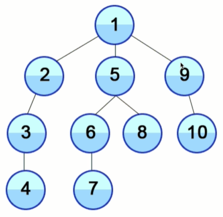

# Algorithms

## Recursion

Recursion is more a concept than an algorithm. Recursion is used in a lot of algorithms.

A Recursive function is a function that refers to itself inside the body of the function.

```javascript
function inception() {
    inception()
}
```

Recursion is good when there are tasks that need to be repeated (e.g. traversing a tree, searching).

Need to ensure that a stopping criterion is eventually met - otherwise the function won't stop calling itself and eventually lead to a stack overflow. 

Every recursive function needs to have a <strong>base case</strong> (a stop condition):

```javascript
let counter = 0
function inception() {
    if (counter > 3) { // Base case (when to stop)
        return 'Done'
    } else {
        counter++
        return inception() // Recursive case
    }
}
```
<strong>Note</strong>: Need to return the last call to inception() so the result <em>'Done'</em> can 'bubble up' to the last call. Otherwise, only the last call to inception wil lreturn 'Done', and the other calls to the function will return undefined (because they're not tasked with returning anything).

Overall, there are a number of things to remember when building a recursive function:

1. Identify the <strong>Base Case</strong> (when to stop)

2. Identify the <strong>Recursive Case</strong> (when to keep going)

3. Make sure you keep getting closer and closer to the base case, and return when needed. 

4. Usually, there are <strong>two returns</strong>; one for the final value, and one for the recursive call.

#### Tree diagram for recurrsive fibonacci algorithm


There's a theorem that states <em>Anything that can be done recursively can be done itteratively</em>

However, there are times when recursion can be beneficial. e.g. Functions written in fewer lines of code, so more DRY and readable.

#### Recursion Pros
DRY and readable

#### Recursion Cons
Large stack (inefficient)

#### When to use Recursion

- When it comes to traversing to trees or graphs, recursion is very useful and can be better than itterative approaches.

- When you're using a tree or converting something into a tree.

- Some criteria for questions that can be answered recursively:
    1. The problem can be divided into a number of subproblems that are smaller instances of the same problem

    2. Each instance of the subproblem is identical in nature

    3. The solutions of each subproblem can be combined to solve the problem at hand

## Sorting

There are tons of different sorting algorithms. There's a whole wikipedia page on sorting algorithms. These sorting algorithms have different tradeoffs.


It has been shown that comparison sorting algorithms cannot be more efficient that O(n long(n))

#### Bubble Sort

Simple, elementary sorting algorithm

The largest number 'bubbles up' to the top. Every pair of numbers gets compared and the largest one gets pushed to the end, one pair at a time. Do this for multiple passes, each time getting the largest number and putting it at the end.

It's one of the simplest sorting algorithms, but it't not efficient.

#### Selection Sort

Simple, elementary sorting algorithm

Scans a list of items for the smallest element, and swaps that element with the element in the first position.

#### Insertion Sort

Simple, elementary sorting algorithm

Scans the values one-by-one, remembers the values, and rearranges each value relative to the ones already scanned, based on its position.

Especailly efficient when the list is short, or already nearly sorted.

#### Merge Sort 

More complex sort, but usually more efficient than simple, elementary sorting algorithms

The three prior sorting algorithms use nested loops (O(n^2) complexity). 

Merge sort uses divide and conquer, which results in O(n log(n)) complexity). Note: Divide and conquer can be implemented with recursion.

It's complicated to implement with code - so probably never have to implement by hand.


#### Quick Sort

More complex sort, but usually more efficient than simple, elementary sorting algorithms.

Just like merge sort, it's a divide-and-conquer algorithm (so can be implemented with recurrsion).

Implementing quick sort is even more complicated than merge sort - something I can try some other time.

Quick sort and mergesort are probably the two most used sorting algorithms.

Quick sort is uaually faster on average, but has worse worst-case perfoamance.

#### When to use which sort?

Insertion sort - when the number of inputs is small, or it's already kind-of sorted, insertion sort is very fast.

Bubble sort - never used because it's not efficeint. Just used for educational purposes.

Selection sort - never used because it's not efficeint. Just used for educational purposes.

Merge sort - really good because of divide and conquer. And since the worst case is O(n log n), we can guarantee performance. Downside is that it takes up more memory than quicksort.

Quick sort - can be better than merge sort when space is a limitation, and when occassional worst case performance is okay. Typically more efficient than merge sort, but cannot guarantee performance since worse case is O(n^2).

#### Other sorting algorithms

Sorting algorithms can be divided into two categories 

- <strong>Comparison sort</strong> (sorting by comparing elements)

    Includes all of the sorting algorithms above. Matematically, cannot do better than O(n log(n)) complexity.

- <strong>Non-comparison sort</strong>

    e.g. Counting sort, Radix sort, Bucket sort, etc

    Instead of sorting by comparison, these algorithms sort by taking advantage of how data is stored in the computer. These algorithms only work for integers in a restricted range. These algorithms have better time complexity than O(n log(n)).

#### Sorting questions

Probably won't be asked to implement a sorting algorithm from scratch. Questions are more likely to be:

<strong>Given this problem, what sorting algorithm would you use?</strong>

## Searching

#### Linear Search

aka sequential search.

Method of finding a target value in a list. Looks for a value sequentially in a list until the value is found.

It's O(n) complexity, so not so fast when working with lots of data. 

#### Binary Search

If the list is <strong>sorted</strong>, we can perform Binary Search. 

It's O(log(n)) complexity, because it's esentially searching as if the list was a binary search tree.


#### Tree Traversals

In some cases, it's necessary to go to every node in a tree or graph. This is called traversing.

Because this involves visiting every node, this is O(n) time complexity.

Breadth First Search and Deptyh First Search are variants of traversing algorithms.

#### Breadth First Search (BFS)

Start at the root node, and go down <strong>one level at a time</strong>, searching left to right.

This takes up more memory because it requires us to track the child nodes of every node at a given level, while searching that level.


#### Depth First Search/Traversal

Start at the root node, and go down <strong>one branch at a time<strong>, until the target is found or the end is reached. 

If the end is reached before the target is found, go back to the ancestors, and explore a different branch. 

Has lower memory requirements than BFS because it's not necessary to store all the child pointers at each level.



Like going through a maze. Keep following a path until a dead-end, then going back and trying a different path.

#### BFS vs DFS

- The time complexity are the same (O(n)) because both algorithms involve visiting each node once.

- BFS is good at finiding the shortest path between nodes because the algorithm involves checking the closest nodes first.

- DFS is good at figurout out if a path exists between two nodes.

- DFS uses less memory than BFS, but it can get slow if the tree/graph is very deep.

- BFS is good when you have prior information that the target is likely to be at the <strong>top</strong> of the tree. 

- DFS good when you have prior information that the target is likely to be at the <strong>bottom</strong> of the tree.

#### PreOrderm, InOrder, and PostOrder

There are different ways of doing Depth First Search. Google for more info.

#### Common question

A common question is how to validate a binary search tree (hint: BFS is good for this).

What searching algorithm to use for finding the shortest path between nodes in a graph?

#### Bellman-Ford and Dijkstra Algorithms

These algorithms are used to find the shortest path in a weighted graph. DFS and BFS can't be used in a weighted graph because those algorithms 

The Ballman-Ford algorithm can handle negative weights, whereas the Dijkstra algorithm can't.

But the Dijkstra algorithm is more efficient than the Bellman-Ford algorithm.

## Dynamic Programming


