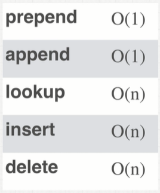
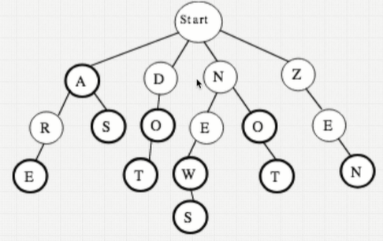
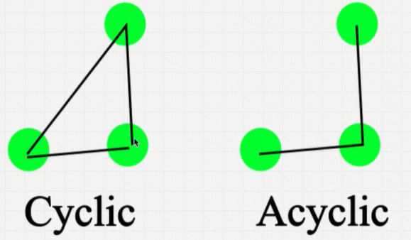

# Data Structures
## Array

Organizes items sequentially in memory
#### Static vs Dynamic Arrays
- Static arrays are fixed in size. The size needs to be specified at the start. If the size needs to change later on, the data has to be reallocated to a new area in memory.
- Dynamic arrays can change length as needed. Memory is dynamicly allocated as needed.

 
<strong>A lot of string questions can be thought of as array questions.</strong> For example, reversing a string can be thought of as reversing an array. 

#### Array Pros
- Fast lookups
- Fast push/pop
- It's ordered

#### Array Cons
- Slow inserts
- Slow deletes
- Fixed size (if using static array)

## Hash Table
a.k.a. Objects (JavaScript), Dictionaries (Python), Maps (Java), Hashes (Ruby).

A Hash Table is a collection of key-value pairs.

Hash Tables are kind-of a black box in the way it stores the data. It's not ordered like an array. The Hash Table will decide where the data is stored in Memory.

A hash function generates an output of fixed length for any input that it gets. For example, SHA-1, SHA-256, md5, etc. These hash functions create a memory address for any given input. This is why it's fast to retrieve data from a Hash Map.

<strong>Hash collision a problem with using Hash Tables</strong>

Hash collisions occur when two different inputs generate the same hashed output, and get saved in the same memory address. The big downside of this is that it can cause lookup operations to be of time complexity O(n) instead of O(1). There are many different methods for dealing with hash collisions.

#### Hash Table Pros
- Fast lookups (but good collision resolution needed)
- Fast inserts/deletes
- Flexible keys

#### Hash Table Cons
- Unordered
- Slow key itteration

## Linked List

With static arrays, the problem was a fixed amount of memory. Memoery can increase by doubling up memory in a nother location, but that has perofmance issues (O(n)). 

With has tables, it's hard to sort.

Linked lists are a structure with trade-offs that can overcome these problems.

Array items are located next to eachother in memory. This makes reading sequential items faster. Nodes of linked lists are not, so it can be slower to read sequential items, even if it's technically O(1).

It's kind-of like a hash-table in that the items are scattered randomly in memory. But it has a benefit that the nodes are linked to eachother (which makes them sortable). 

Doubly linked lists have an extra pointer that also points to the previous node. 

#### Linked List Pros
- Fast insertion
- Fast deletion
- Ordered
- Flexible size

#### Linked List Cons
- Slow lookup
- More memory

#### Linked List Questions

A common question is to <strong>Reverse a linked list</strong>

## Stacks + Queues

Stacks and Queues are kind-of like arrays with less functionality. They're similar to arrays in that the elements within Stacks and Queues are ordered, but the limitation is that operations can be performed on only the first or last element - unlike array, where operations can be done to the middle of the array.

This limited functionality can be useful in situations when we want to limit how the structure can be used.

#### Stacks

It's like a stack of plates - First in, last out (FILO). Only the top plate (the one that was added last) is accessible. 

Stacks can be built with arrays or linked lists. Using an array will technicly be faster because elements are next to eachother in memory, but using a linked list makes it easier to expand the stack as needed.

#### Queues

It's like a queue in real life - elements will be put in a line, and be accessible in the order they were added - First in, first out (FIFO)

Queues should never be built with an array because queues involve adding elements from to beginning. For arrays, this takes O(n) time. Instead they should be built using linked lists, which only takes O(1) time. 

#### Stacks and Queues Pros
- Fast operations (eventhough there are a limited number of operations)
- Fast peek
- Ordered

#### Stacks and Queues Cons
- Slow lookup

## Trees

Trees have a heirarchical structure.

For example, the DOM is a tree structure (parent/child nodes).

Previously, computer chess players used a tree structure for decision making (decision tree).

There are lots of different trees (with different properties), but they all share similar characteristics.

#### Binary Tree

A binary tree is a tree with the following rules:
- Each parent can only have zero, one, or two child nodes.
- Each child can only have one parent.

#### Binary Search Tree
A subset of a binary tree:
- Tree that are really good at for searching
- This datastructure preserves relationships (unlike hash tables)

Here are the rules:
- All the child nodes to the right must be larger than the node
- All the child nodes to the left must be smaller than the node

These rules make it efficient to search for a value. It also makes it efficient to insert and delete an item (but less efficient than structures like hash tables that enable insert and delet in O(log(n)) time).

Perfect binary search trees are the most efficient (each node as two child nodes, except the last set of nodes that have no children). Unbalanced trees just become a long linked list, so lose the benefits of efficient search, insert, and delete.

Pros of Binary Search Trees:
- Pretty much all operations are better than O(n)
- Ordered
- Flexible size

Cons of Binary Search Trees:
- No O(1) operations

#### AVL Trees + Red Black Trees
We have seen that unbalanced trees do not enable efficient operations. Binary Search Tress have the potential to become very unbalanced. Therefore, in most cases, people imeplement AVL Trees or Red-Black Trees instead. These trees automatically rebalance, so mitigate the risk of having a very unbalanced (this inefficient) tree.

#### Binary Heaps
There are different types of heaps, but the binary heap is the most common type.

A Max. Heap is one where the parent node has a greater value than the children nodes. A Min. Heap is the other way around.

Lookups become less efficient (O(n)) becahse there is no longer any relationship between left and right nodes. That means we have to potentially look through every node to look for a particular value. 

But this structure is useful for comparitive operations. e.g. Get all the values greater/less than 72.

Inserting is done left-to-right, starting at the bottom, then bubbling up. i.e. It's different than how inserting is done in a binary tree, but the complexity is also O(log(n)).

Note: Bonary Heaps are different from Memory Heaps.

One use of a binary heap is to create a priority queue, where each element has a different value for priority (instead of a simple queue which is simple FIFO). 

#### Tries

Used for specialized searching (like for text). 

Can be useful for something like searching for words in a dictionary. The complexity for finding a word is O(word length). e.g. A-L-G-O-R-I-T-H-M

## Graphs

Graph at are great at representing relationships between elements. They can be used to represent roads, people, maps, etc.

There are many types of graphs. Trees and Linked Lists are type of Graphs. But there are a number of important characteristics:

#### Direction

- Directed (One-way between two nodes)
- Undirected (Two-way between two nodes)

#### Weight

- Weighted (values attached to edges)
- Unweighted (all edges are equal)

#### Cyclic

- Cyclic (graphs where nodes are conencted in a way where relationships can go around 'in a circle')
- Acyclic 

#### Ways to build graphs

There are many ways to build graphs. They can be thought of as:

- <strong>Edge list</strong>: A list of edges. e.g. [[0, 2], [2, 3], [1, 2]] has three nodes (0, 1, 2, 3) and 3 edges (each array)

- <strong>Adjacent lists</strong>: [[2], [2], [3], [2]] Where each index is a node, and the array at each index indicates other nodes that it's adjacent to.

- <strong>Adjacency Matrix</strong>: A matrix of connections between nodes (1 for connected, 0 for not connected) 

#### Pros of graphs
Complicated because there are so many different types of graphs. But generally, good at representing relationships.

#### Cons of graphs
Generally, scaling is hard.

